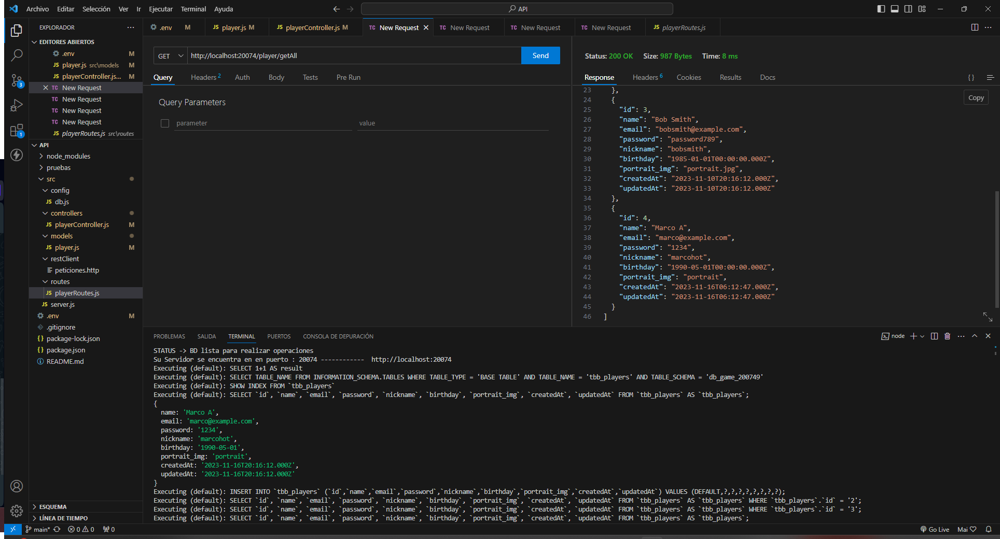

# DMI_Practica16_200749

  
# Universidad Tecnológica de Xicotepec de Juárez

## Ingeniería en Desarrollo y Gestión de Software

## Desarrollo Movil Integral

## Marco Antonio Rosas Gonzalez
 
## 10° "A"

## Septiempre - Diciembre

## PRÁCTICA 16: Creacion del modelo jugadores e implementacion de busqueda de todos los jugadores existentes.

## Descripción:Una práctica de una API REST desarrollada en Node.js es un enfoque eficiente y versátil para crear servicios web. Esta API ofrece operaciones CRUD (Crear, Leer, Actualizar y Borrar) para gestionar recursos de datos. Utilizando Express.js, se configuran las rutas y controladores correspondientes para cada operación.

